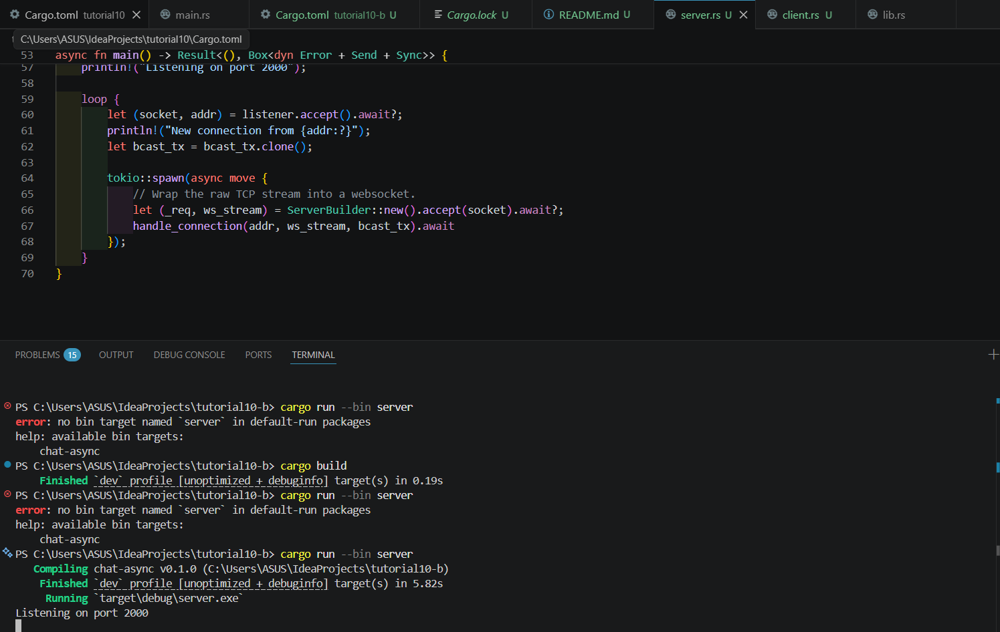
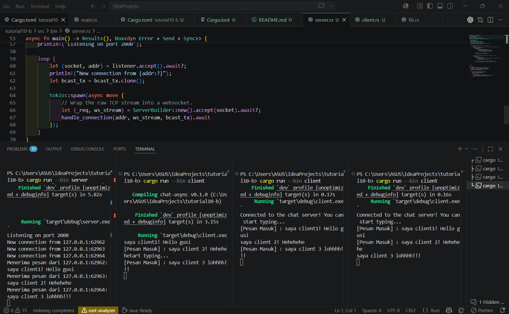

## How to Run the Chat App

Dibutuhkan beberapa instance terminal (1 untuk Server, dan 3 untuk Clients).

1. **Jalankan Server**
   
   Jalankan server (langkah awal):
   ```Bash
   cargo run --bin server
   ```

   Terminal akan menampilkan: ```Listening on port 2000.```

2. **Jalankan 3 Client** 

Buka 3 terminal baru. Di setiap terminal baru tersebut, jalankan:
```Bash
cargo run --bin client
```
Server akan mencatat log New connection from ... setiap kali client baru bergabung.

### Ketika mengirimkan pesan melalui client:
- Non-Blocking Input: Menggunakan `tokio::select!`, client secara bersamaan menunggu input dari keyboard (`stdin`) dan pesan masuk dari server tanpa saling mengunci (non-blocking).

- Asynchronous Processing: Begitu teks dikirim, server menerima pesan tersebut dan mempublikasikannya ke dalam `tokio::sync::broadcast` channel.

- Smart Broadcasting (Optional Task): Server telah diprogram untuk membandingkan `SocketAddr` pengirim. Pesan akan diteruskan ke seluruh client yang terhubung, kecuali ke terminal pengirim asli (menghindari echo diri sendiri).

- Visual Check: Jika mengetik "Hello!" di Client 1, maka Client 2 dan Client 3 akan menerima `[Pesan Masuk] : Hello!`, sementara layar Client 1 tetap bersih dari duplikasi.

## Screenshots:




## Modifikasi Port WebSocket
Untuk mengubah port koneksi WebSocket dari `2000` menjadi `8080`, modifikasi harus dilakukan pada kedua sisi koneksi (Server dan Client). Hal ini dikarenakan keduanya harus mengandalkan protokol dan alamat yang sama persis agar dapat saling berkomunikasi.

### Sisi Server (`src/bin/server.rs`):

Server perlu mengetahui port mana yang harus dibuka untuk mendengarkan (listen) koneksi yang masuk. Konfigurasi ini ditentukan pada fase TCP binding. Saya mengubah kode `TcpListener::bind("127.0.0.1:2000")` menjadi `TcpListener::bind("127.0.0.1:8080")`.

### Sisi Client (`src/bin/client.rs`):
Client perlu mengetahui port tujuan yang tepat untuk mengirimkan permintaan koneksi. Informasi ini didefinisikan di dalam URI WebSocket. Saya mengubah `Uri::from_static("ws://127.0.0.1:2000")` menjadi `Uri::from_static("ws://127.0.0.1:8080")`.

Kedua belah pihak menggunakan protokol WebSocket yang ditandai dengan skema `ws://` pada URI client. Protokol ini dikelola oleh pustaka (library) `tokio-websockets` (melalui `ServerBuilder` dan `ClientBuilder`) yang berjalan di atas aliran (stream) TCP mentah.